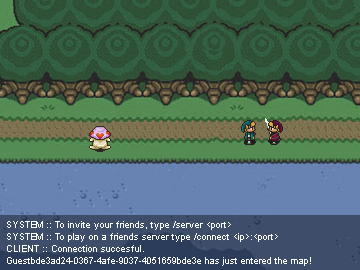

## NO LONGER MAINTAINED! #

> ## tl;dr ##
> **Melodia is a mulitplayer game written in Java, inspired by games like Zelda and Secret of Mana.**

This project is what has become of a little experiment gone out of hand. While learning my first steps in Java, I was wondering how a game would work. A while later I had a static image moving on top of another image by pressing the arrow keys.

*Fast forward a few years and this is the result;*

Melodia has become a multiplayer game, making the player able to walk across different maps (of which two are realised in the proof of concept). Players are able to kill monsters, die themselves only to be respawned anew. Change the colours of their tunics to any given colour and chat with each other.

This all wrapped up in a little proof of concept game called Melodia, with background music taken from Ragnarok Online and maps, sprites taken from Zelda: blabla and Secret of Mana.

Important; read the disclaimer about the use of these sprites and images.

### Source code is licensed under the MIT License. ###
#####  *Images/sprites/audio etc. belong to their respective owners!* #####

## Usage ##

- Navigation with arrow keys or WASD.
- Attack with 'F'
- 'Enter' to enable Chat for commands;
 - /nick <name> to change your name
 - /color shows a screen where you can change your sprite's colour.
 - /server <port> makes the current instance the server
 - /connect <serverip:port> to connect to this instance from another client.
 - /list shows a list of connected clients and players.
 - /loc shows the current location.
 - /dev <on|off> for developer mode, this will show the *walkmap*.
 - /walkcheck to turn off the walkcheck, enabling you to walk anywhere.
 - /bg <on|off> to turn on/off the background music.

## Demo / PoC ##

I also made a demo proof of concept in HTML5 & JavaScript, which is hosted here <http://www.nickmeessen.nl/melodia>

## Disclaimer ##

Being a programmer first, I took these sprites from Shyguy Kingdom to realise a simple game that looked good as well. These images and other resources used belong to their respective owners. The source code written in Java and XML is licensed under the MIT License, which means you are free to fork and build upon this game. I have abandonded it, so feel free but give credit where due. It has gained some sentimental value in my early years of learning how to code ;-)

**Excerpt from <http://tsgk.captainn.net>**

> The Shyguy Kingdom does not own the sprites contained on the pages within this site. The sprites on this site are the works of countless others whose names would be too many to mention and, in the case of the sprites from games, are often unknown. The Shyguy Kingdom presents these sprites as an archive and gallery of game and pixel art and to promote these games, just as game websites present screenshots to do the same. At the request of any artist or company responsible for any of the artwork in the The Shyguy Kingdom's pages, the sprites of that artist or company will be immediately removed.

> However, in regards to the sprite sheets in the pages of The Shyguy Kingdom, there are also features which extend beyond the properties of their respective artists: the layout, the organization, and additional data contained within the sprite sheets that is the intellectual property of The Shyguy Kingdom excludes the publishing of these images without the permission of The Shyguy Kingdom without exhibited modification. This is not due to any attempted ownership of artwork that are not the property of The Shyguy Kingdom, but rather of the data other than the artwork in the sheets.

> The Shyguy Kingdom believes that the artwork of games is meant to be seen and that its use and display on this site ultimately benefit the artists and companies behind them through the created fandom and publicity. The Shyguy Kingdom exists to promote pixel-based sprite artwork in its varied forms and the great forces behind them.
